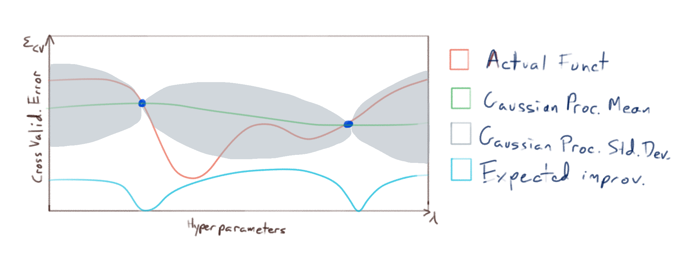

# Bayesian Optimization Demo
A short demonstration where bayesian optimization is used to make a good choice of hyperparameters.

Consider the following data set (pictured at two separate scales):

There seems to be a linear relationship between $$x$$ and $$y$$, and the $$y$$-values seem to concentrate near $$x=0$$ and disperse for large values of $$x$$.
We want to model the data near $$x=0$$ via the following model

$$y = a x+b+\epsilon$$

where $$\epsilon$$ is noise which depends on $$x$$.
Notice that there are some extreme outliers, so using a least-squares approach doesn't lead to a good fit. we need $$\epsilon$$ to *heavy-tailed*; so we fit a student t distribution (where the mode, scale, and shape all depend on $$x$$) using gradient descent.

Of course, this is a toy problem, which we are playing with because it is simple to visualize; this tutorial is really about Bayesian optimization:
The challenge is that we won't acheive a good fit without proper regularization, and we then need to choose hyperparameters $$\lambda_1,\dots,\lambda_n$$ to control the regularization. For any given choice of hyperparameters, we can fit our model on a training subset of the data, and then evaluate the fit on a cross-validation subset of data leading to an error function:

$$\varepsilon_{CV}(\lambda_1,\dots,\lambda_n):=\textrm{CrossValidationError}(\lambda_1,\dots,\lambda_n)$$

which we want to minimize. To minimize this we could use:

1. A grid search for optimal values of $$\lambda_1,\dots,\lambda_n$$,
2. A random search for optimal values of $$\lambda_1,\dots,\lambda_n$$,
3. Numerical Optimization (such as Nelder-Mead),
4. Bayesian Optimization.

Note that sampling $$\varepsilon_{CV}$$ at a choice of hyperparameters can be costly (since we need to fit our model each time we sample); so rather than sampling $$\varepsilon_{CV}$$ either randomly or on a grid, we'd like to make informed decisions about the best places at whcih to sample $$\varepsilon_{CV}$$. Numerical Optimization and Bayesian Optimization both attempt to make these informed decisions, and we focus on Bayesian Optimization in this tutorial.

The basic idea is as follows: we will sample $$\varepsilon_{CV}$$ at a relatively small number of points, and then fit a gaussian process to that sample: i.e. we model the function $$\varepsilon_{CV}(\lambda_1,\dots,\lambda_n)$$ (pictured in red):

This model give us estimates of both 

1. the expected (mean) value of $$\varepsilon_{CV}$$ if we were to sample it at novel points (pictured in green), as well as
2.  our uncertainty (or expected deviation) from that mean (the region pictured in grey),

and we use this information to choose where to sample $$\varepsilon_{CV}$$ next. Now it is important to note that our primary concern is not to accurately model $$\varepsilon_{CV}$$ *everywhere* with our gaussian process; our primary concern is to accurately model $$\varepsilon_{CV}$$ near it's **minimums**. So we sample $$\varepsilon_{CV}$$ at points where we have the greatest *expected improvement* of fitting our model to the minimums of $$\varepsilon_{CV}$$:

and we repeat until our model fits $$\varepsilon_{CV}$$ accurately enough near it's minimums:

Finally, we use the resulting model to make an optimal choice for our hyperparameters $$(\lambda_1,\dots,\lambda_n)$$.

The full tutorial can be found in the jupyter notebook `RegressionWithBayesOpt.ipynb`.